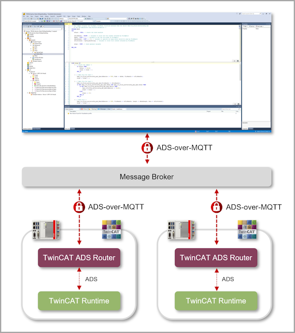

# About this repository
This repository contains official configuration examples for the technology ADS-over-MQTT offered by [Beckhoff Automation](https://www.beckhoff.com). ADS-over-MQTT allows you to use the Message Queueing Telemetry Transport (MQTT) protocol as a built-in transport protocol for Beckhoff ADS. ADS applications can therefore benefit from all the advantages of a publisher/subscriber based communication pattern with built-in support for Transport Layer Security (TLS).

The following information can be found in this repository:

- [ADS-over-MQTT configuration files](samples/ads-over-mqtt/README.md) that demonstrate how to configure certain use cases
- [Mosquitto configuration files](samples/mosquitto/README.md) that show how to configure Mosquitto Message Broker

The following graphic illustrates the ADS-over-MQTT architecture. It is based on three TwinCAT ADS devices that are connected to the same message broker. One device represents the engineering device (based on TwinCAT XAE) and the other two devices represent runtimes (based on TwinCAT XAR). Thanks to ADS-over-MQTT, all devices can interact with each other on ADS level via the message broker.

 

# How to get support
All content  is provided as-is under the Zero-Clause BSD license. Should you have any questions regarding the provided configuration files, please contact your local Beckhoff support team. Contact information can be found on the official Beckhoff website at https://www.beckhoff.com/contact/.

# Further information
Further information about this sample code can be found on the [Beckhoff Information System](https://infosys.beckhoff.com) in the ADS-over-MQTT documentation.
